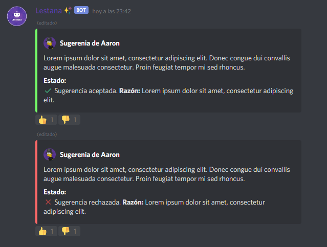

# Sistema de Sugerencias

### ¿Cómo establecer el canal de sugerencias?

Para establecer un canal de sugerencias, utiliza el siguiente comando:

```text
//setsuggest [canal]
```

Como en esta imagen:


### ¿Cómo puedo saber si funciona?

Para saber si funciona el sistema de sugerencias escriba un texto con más de 15 caracteres en el canal que ha establecido.


### ¿Cómo puedo aceptar o rechazar un sugerencia?

Para aceptar una sugerencia utiliza el siguiente comando:

```text
//suggest [ID del mensaje] accept (Razón)
```


Para rechazar una sugerencia utiliza el siguiente comando:

```text
//suggest [ID del mensaje] decline (Razón)
```


Se verían tal que así:



