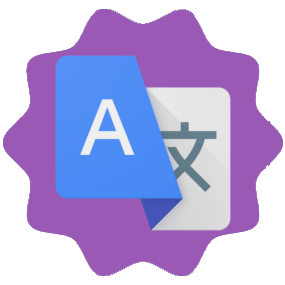

# Insignias

### ¿Qué insignias existen?

Aquí hay una lista de todas las insignias:

* Desarrollador
* Soporte
* Donador
* Traductor


Las insignias todavía **NO** se desarrollan.




### Insignia Desarrollador 

Insignia de desarrollador sólo la tienen aquellos que trabajan en Lestana.




### Insignia Soporte 

Insignia de soporte solo para aquellos que sean parte del Soporte del Lestana



### Insignia Donador

Insignia exclusiva para quienes han donado un poco, para que Lestana siga viva.




### Insignia Traductor

Insignia para los usuarios encargados de traducir a Lestana en distintos idiomas.




